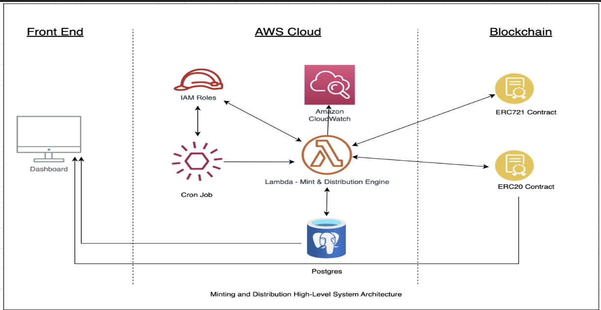
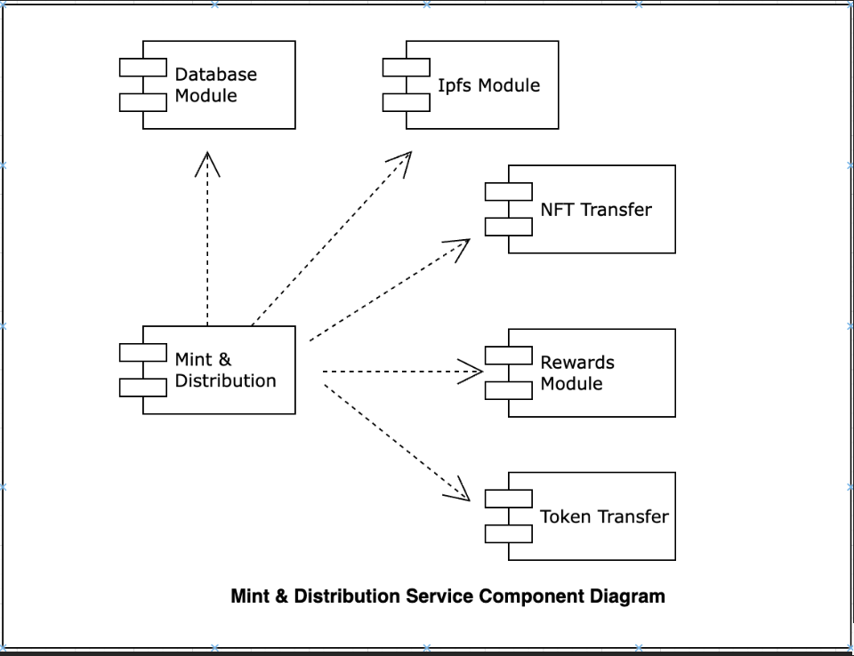
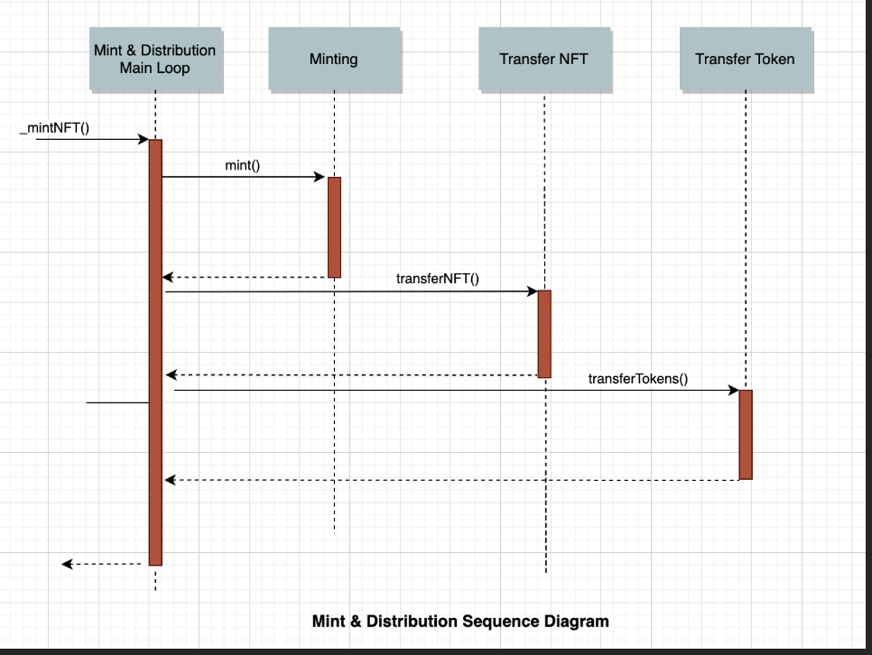
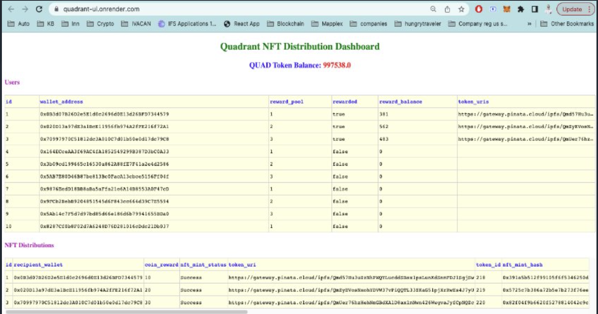

# A Seamless NFT Minting and Distribution Platform

## Overview

QuadNFT is a powerful platform conceived to revolutionize the process of minting Non-Fungible Tokens (NFTs) and distributing them, accompanied by QUAD Tokens as associated rewards, directly into the wallets of users.

The operation of this system is as follows:

User data, including the reward pool they belong to, is retrieved from a PostgreSQL database and processed through a main loop.

For each user, a customized reward amount is dynamically calculated at the time of minting based on specific reward criteria, ensuring a fair and adaptable distribution process.

An NFT, branded as QuadNFT, is minted with a unique token URI, which contains the calculated QUAD Token reward details. This data is securely stored on the InterPlanetary File System (IPFS) through the Pinata service.

The minting process unfolds on the Ethereum network, utilizing smart contracts developed with the Hardhat framework. These smart contracts, extending from OpenZeppelin's secure and reliable ERC721 and ERC20 standards, power the creation of QuadNFTs and QUAD Tokens.

Once the QuadNFT is minted, it's immediately transferred to the user's wallet. Simultaneously, the calculated QUAD Token reward is transferred to the same wallet.

This synchronized process is handled within an AWS Lambda function, ensuring excellent scalability, manageability, and security. By integrating the minting and transfer steps within the same function, the design circumvents potential transaction failures due to nonce inconsistencies.

Specialized RPC Provider Usage: The solution leverages two Ethereum RPC providers tailored to their strengths: QuickNode for minting and transferring the QuadNFT and QUAD tokens, and Infura for the Dash application to retrieve QUAD token balances. This dual usage ensures optimal performance in each process, taking advantage of QuickNode's speed and reliability for transaction-intensive tasks, and Infura's consistency and accessibility for balance retrievals.

Complementing the system is an intuitive dashboard built with the Python Dash framework. This dashboard retrieves and visualizes data from the PostgreSQL database, providing a comprehensive overview of the QuadNFT distribution.

The solution is architected around three distinct code repositories: the smart contracts implementation, the Lambda function, and the Dash dashboard, fostering modularity and maintainability.

## Design & Architecture

### High-level system architecture

### Component Diagram - Mint and Distribution Engine

### Sequence Diagram-Mint & Distribution

### Design Decisions

## Seamless NFT Minting and Distribution: An Iterative Design Approach to Manage Ethereum Transactions

The core design of the minting and distribution process for NFTs and associated tokens in this implementation revolves around a central iteration over a list of users. This design approach ensures a seamless and uninterrupted flow of transactions without the need to manage nonce explicitly, which otherwise could lead to transaction failures.

The program initializes by fetching users eligible for rewards and enters a loop. Within this loop, for each user, it initiates the minting of an NFT and, upon successful minting, triggers the transfer of the NFT and the associated tokens to the user's wallet.

Importantly, the minting and transfer of tokens are handled within the same iterative loop. This is a crucial part of the design, considering that there's only one wallet and one contract instance handling all transactions. If minting and transfer were treated as separate processes, it could potentially cause issues with transaction nonces and lead to failed transactions. However, by encapsulating both operations within the same loop, the design ensures that each minting and transfer operation is fully completed before the next one begins, thereby maintaining the correct nonce count without explicitly passing it in the transaction.

In the case of transaction latency, the program leverages a delay function to pause execution within the loop until the current transaction completes, thereby ensuring that the transaction sequence remains intact.

Additionally, the use of a single Lambda function (\_mintNFT) for handling the minting and transferring of NFTs and associated tokens simplifies management, making it easier to monitor, troubleshoot, and maintain the system within a single, contained environment.

Furthermore, invoking this Lambda function from an AWS Cron job provides automated, time-controlled execution, allowing for predictable and consistent minting and transfer operations.

This design provides a robust, secure, and seamless process for minting NFTs and distributing them to users along with their associated tokens. It also offers a sustainable approach to transaction management, reducing the chances of transaction failures due to nonce discrepancies.

### Opting for PostgreSQL

A robust and structured approach to data handling is provided by the decision to utilize PostgreSQL, a relational database, rather than NoSQL solutions like DynamoDB. This choice is particularly well-suited to the use case of a dashboard application periodically retrieving and displaying data, a scenario where relational databases excel due to their capability to handle complex queries. Data integrity is maintained through the predefined schema of PostgreSQL, allowing for powerful multi-table queries that are essential in generating in-depth insights for the dashboard. Moreover, the proven track record of SQL databases in managing ACID transactions, a key component in financial operations, further underscores the benefits of this choice.

### Opting for Python Dash: Rapid Development and Seamless Data Integration for Web Applications

The preference for the Python Dash framework over popular UI libraries such as React signifies a strategic design decision, driven by the serverless nature of Dash and its proficiency in visualizing relational data. An expedited implementation process is assured with Dash due to its Python-based, user-friendly interface, and its capacity to seamlessly connect with data sources. These advantages, coupled with Dash's robust features for creating interactive, analytical web applications, make it an apt choice for constructing the dashboard.

## Security

### Smart Contract Security

Extends NFT and Token contracts from widely-used and audited contracts from OpenZeppelin (@openzeppelin/contracts/token/ERC20/ERC20.sol and @openzeppelin/contracts/token/ERC721/ERC721.sol).

This ensures the safety and security of our token contracts, as they leverage the proven and trusted foundation provided by OpenZeppelin's open-source framework.

### Lambda Function Security: Ensuring Secure Execution Environment

Securing lambda function

Least Privilege Access Controls: The lambda function is created from AIM role and assigned only necessary permissions enough to execute the function via its IAM role.

Lambda function

### Securing NFT Associate Reward Amount with IPFS

Utilizing the Inter Planetary File System (IPFS) through Pinata, we securely store the NFT metadata which includes associated QUAD Token rewards, ensuring an immutable and tamper-proof record."

### AWS Secrets As Environmental Variables

Security within the Lambda function is assured by leveraging AWS Secrets Manager via IAM, ensuring the secure handling of sensitive data, like our wallet's private key. While in our demonstration we've secured only the wallet's private key, this approach can easily be extended to all other environment variables in a production setting. This enhances our application's security by providing a reliable method for storing, retrieving, and managing secrets within the AWS environment.

### Scalability Considerations and Future Enhancements

The current system design, while efficient for smaller batches, may face challenges in executing larger user batches due to the constraints of the maximum execution time of the AWS Lambda function. An alternative, and potentially more scalable and efficient, architecture would be the implementation of two separate Lambda functions for the minting and distribution of NFTs and token transfers respectively. However, such an approach would require the setup of two distinct wallets for running the two Lambda functions concurrently, to prevent transaction hanging due to nonce conflicts when using a single wallet. This architectural refinement, although more complex, promises enhanced scalability for handling larger volumes of transactions.

### Implementation Details and Deliverables

There are three code repositories for the solution for modularity and maintenance ease. Each repository contains README files with instructions on how to run them locally. Also I have committed the .env files in repositories for easiness for someone else to run them straight locally. (In ideal scenario the .env files should not be committed in git repositories).

Token Contracts

Quadrant Tokens: This repository holds the implementation of the Smart Contracts using the Hardhat Framework. It encompasses the logic for token generation and management.

https://github.com/nuwanrg/quadrant-tokens

Contract addresses

NFT Contract -

https://mumbai.polygonscan.com/address/0x0756a62034fdbfbd30394dab44d9309ec0c62d8c

Token(Coin) Contract

https://mumbai.polygonscan.com/address/0x7e9b6041a9f845cd4790c97a01ef4dd1afec316a

Mint and Distribution Module – Lambda Function

Quadrant Mint Service: This repository contains the Lambda function implementation using Javascript and Ethers. It manages the minting and distribution of NFTs and associated tokens to users' wallets.

https://github.com/nuwanrg/quadrant-mint-service

Dashboard

Quadrant UI: This repository is dedicated to the Dashboard UI, which is built using the Python Dash framework to visualize Minting and Distribution processes.

https://github.com/nuwanrg/quadrant-ui

Dashboard URL

              https://quadrant-ui.onrender.com/

